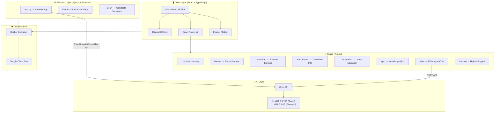
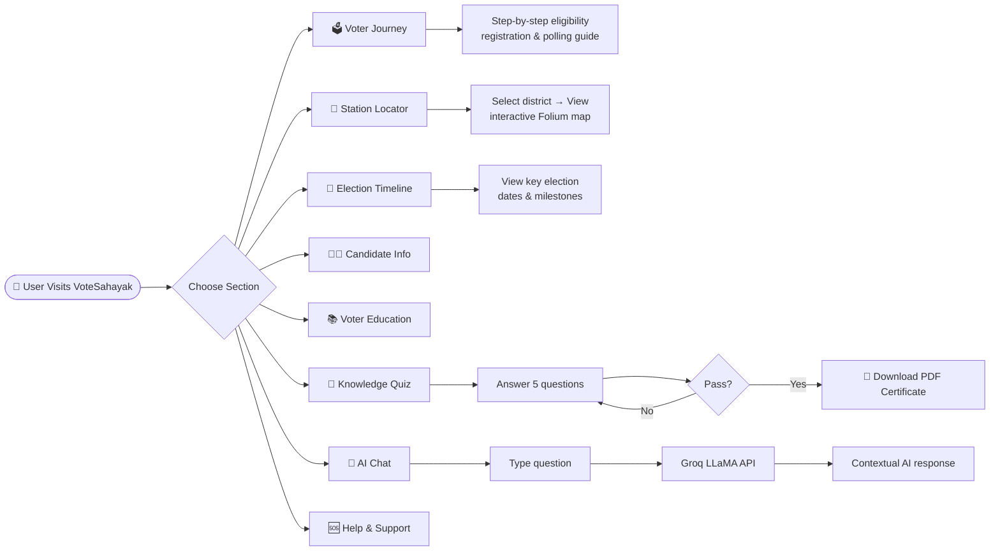

<div align="center">
  

  <h1>🗳️ VoteSahayak</h1>
  <h3><i>Your Comprehensive Guide to the Indian Election Process</i></h3>

  <p>
    
    
    
    
    
    
    
    
  </p>
</div>

---

## 📌 Overview

**VoteSahayak** (meaning *"Voting Helper"* in Hindi) is a full-stack, AI-powered civic education platform built to help Indian citizens understand and navigate the democratic election process with confidence. It combines an interactive React frontend with a feature-rich Streamlit backend to deliver step-by-step voter guidance, an AI chat assistant, interactive maps, educational quizzes, and more — all wrapped in a premium, dark-themed UI with Indian tricolor accents.

> Built for the **PromptWars Hackathon**, VoteSahayak demonstrates how AI can empower citizens in a democracy.

---

## 🏗️ Architecture Diagram



---

## 🔄 User Flow Diagram



---

## ✨ Key Features

| Feature | Description | Tech Used |
|---|---|---|
| 🗳️ **Voter Journey** | Interactive 6-step guide: eligibility → registration → voter list → EPIC card → polling day → results | React, shadcn/ui |
| 📍 **Station Locator** | District-level map (Kolkata, Howrah, South 24 Parganas, North 24 Parganas, Hooghly) with searchable booth cards | Folium, Leaflet |
| 📅 **Election Timeline** | Visual chronological tracker for all key election milestones | React, Motion |
| 🧑‍💼 **Candidate Info** | Candidate profiles and comparison tool | React |
| 📚 **Voter Education** | Comprehensive educational resources on EVMs, VVPATs, NOTA, and electoral laws | React |
| 🎯 **Knowledge Quiz** | 5-question gamified quiz with instant scoring | React, jsPDF |
| 📄 **PDF Certificate** | Auto-generated "Informed Voter" certificate for quiz completers | jsPDF |
| 💬 **AI Chat Assistant** | Real-time conversational AI powered by Groq's LLaMA 3.3 70B model, election-scoped | Groq API |
| 🆘 **Help & Support** | ECI helplines, FAQ, and direct support contacts | React |

---

## 🛠️ Tech Stack

### Frontend (React App — `src/`)

| Layer | Technology |
|---|---|
| **Framework** | React 18.3 + TypeScript 5.5 |
| **Bundler** | Vite 6.3 |
| **Routing** | React Router v7 |
| **Styling** | Tailwind CSS v4 + shadcn/ui components |
| **Animations** | Framer Motion (via `motion` package) |
| **Icons** | Lucide React |
| **AI Chat** | Groq API (`llama-3.3-70b-versatile`) |
| **Certificate** | jsPDF |

### Backend (Streamlit App — `app.py`)

| Layer | Technology |
|---|---|
| **Framework** | Streamlit |
| **Maps** | Folium + streamlit-folium |
| **AI Integration** | Groq API (`llama-3.1-8b-instant`) via OpenAI-compatible client |
| **Certificate** | jsPDF (injected via HTML) |

### Infrastructure

| Layer | Technology |
|---|---|
| **Containerization** | Docker |
| **Deployment** | Google Cloud Run |
| **CI/CD** | Google Cloud Build |

---

## 📁 Project Structure

```
VoteSahayak/
├── 📂 src/
│   ├── 📂 app/
│   │   ├── 📂 components/
│   │   │   └── 📂 ui/          # shadcn/ui components (Button, Card, etc.)
│   │   ├── 📂 pages/
│   │   │   ├── Journey.tsx      # Voter step-by-step guide
│   │   │   ├── Locator.tsx      # Polling station map
│   │   │   ├── Timeline.tsx     # Election calendar
│   │   │   ├── Candidates.tsx   # Candidate information
│   │   │   ├── Education.tsx    # Civic education resources
│   │   │   ├── Quiz.tsx         # Knowledge quiz + certificate
│   │   │   ├── Chat.tsx         # AI chatbot (Groq-powered)
│   │   │   └── Support.tsx      # Help & contact info
│   │   ├── App.tsx              # Root component
│   │   ├── layout.tsx           # Sidebar navigation layout
│   │   └── routes.tsx           # React Router definitions
│   ├── 📂 styles/
│   │   ├── index.css            # Entry CSS (imports below)
│   │   ├── tailwind.css         # Tailwind v4 setup
│   │   ├── theme.css            # shadcn design tokens + @theme
│   │   └── fonts.css            # Google Fonts
│   └── main.tsx                 # React entry point
│
├── app.py                       # Streamlit backend application
├── Dockerfile                   # Container definition
├── requirements.txt             # Python dependencies
├── vite.config.ts               # Vite + Tailwind v4 config
├── package.json                 # Node.js dependencies
├── default_shadcn_theme.css     # shadcn theme reference file
└── .env.example                 # Environment variable template
```

---

## 🚀 Getting Started

### Prerequisites

- **Node.js** 18+ and **npm** / **pnpm**
- **Python** 3.8+
- **Groq API Key** (free at [console.groq.com](https://console.groq.com/))

### 1. Clone the Repository

```bash
git clone https://github.com/nafisalam72/VoteSahayak.git
cd VoteSahayak
```

### 2. Set Up Environment Variables

```bash
cp .env.example .env
# Edit .env and add your Groq API key:
# VITE_GROQ_API_KEY=your_key_here
# GROQ_API_KEY=your_key_here
```

### 3. Run the React Frontend

```bash
npm install
npm run dev
# App available at http://localhost:5173
```

### 4. Run the Streamlit Backend (Optional)

```bash
pip install -r requirements.txt
streamlit run app.py
# App available at http://localhost:8501
```

### 5. Run with Docker

```bash
docker build -t votesahayak .
docker run -p 8501:8501 -e GROQ_API_KEY=your_key votesahayak
```

---

## ☁️ Deployment (Google Cloud Run)

```bash
# Authenticate
gcloud auth login
gcloud config set project YOUR_PROJECT_ID

# Build and deploy
gcloud run deploy votesahayak \
  --source . \
  --region asia-south1 \
  --allow-unauthenticated \
  --set-env-vars GROQ_API_KEY=your_key
```

---

## 🎨 Design System

The UI is built on a **premium dark theme** with Indian tricolor accents:

| Token | Color | Usage |
|---|---|---|
| Primary Accent | `#FF9933` (Saffron) | Headings, active states, CTAs |
| Secondary Accent | `#046A38` (India Green) | Badges, success states |
| Background | `#0A0F15` / `slate-950` | Main app background |
| Surface | `#0F172A` / `slate-900` | Cards, sidebar, modals |
| Typography | Inter (Google Fonts) | All text |

---

## 📊 Data Coverage

- **Districts Covered:** Kolkata, Howrah, South 24 Parganas, North 24 Parganas, Hooghly (West Bengal)
- **Polling Stations:** 15 mock stations with GPS coordinates
- **Election Events:** 6 key milestones (West Bengal Assembly Election 2026 mock data)
- **Quiz Questions:** 5 core questions covering voting age, EVM, NOTA, ECI helpline, and registration

---

## ⚠️ Disclaimer

VoteSahayak is an **educational project** built for the PromptWars Hackathon. It is **not officially affiliated** with the Election Commission of India (ECI). Polling station data shown is for **demonstration purposes only**. For official information, visit [voters.eci.gov.in](https://voters.eci.gov.in/).

---

## 📄 License

This project is open source. See [ATTRIBUTIONS.md](ATTRIBUTIONS.md) for third-party credits.

---

<div align="center">
  <p>Made with ❤️ for Indian Democracy</p>
  <p>
    <a href="https://voters.eci.gov.in/">🗳️ ECI Voter Portal</a> &nbsp;|&nbsp;
    <a href="https://console.groq.com/">🤖 Get Groq API Key</a> &nbsp;|&nbsp;
    <strong>ECI Helpline: 1950</strong>
  </p>
</div>